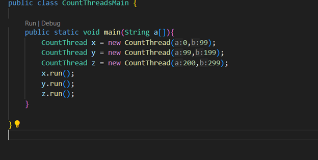

### Escuela Colombiana de Ingeniería
### Arquitecturas de Software - ARSW
## Ejercicio Introducción al paralelismo - Hilos - Caso BlackListSearch

-----------------------------------------------------------------------------------------
#### Realizado por: Nicolas Sebastian Achuri Macias y Ricardo Andres Villamizar Mendez
---------------------------------------------------------------------------------------

### Dependencias:
####   Lecturas:
*  [Threads in Java](http://beginnersbook.com/2013/03/java-threads/)  (Hasta 'Ending Threads')
*  [Threads vs Processes]( http://cs-fundamentals.com/tech-interview/java/differences-between-thread-and-process-in-java.php)

### Descripción
  Este ejercicio contiene una introducción a la programación con hilos en Java, además de la aplicación a un caso concreto.
  

**Parte I - Introducción a Hilos en Java**

1. De acuerdo con lo revisado en las lecturas, complete las clases CountThread, para que las mismas definan el ciclo de vida de un hilo que imprima por pantalla los números entre A y B.

&emsp;&emsp;&emsp;

2. Complete el método __main__ de la clase CountMainThreads para que:
	1. Cree 3 hilos de tipo CountThread, asignándole al primero el intervalo [0..99], al segundo [99..199], y al tercero [200..299].

    	&emsp;&emsp;&emsp;
    
	2. Inicie los tres hilos con 'start()'.
    
	3. Ejecute y revise la salida por pantalla.

	&emsp;&emsp;&emsp;

	4. Cambie el incio con 'start()' por 'run()'. Cómo cambia la salida?, por qué?.

    	&emsp;&emsp;&emsp;
    	&emsp;&emsp;&emsp;

--------------------------------

 La diferencia en principio es vista como la concurrencia desde la salida con run la cual es completamente evidente, cada hilo corre independientemente y hace el debido conteo haciendo que los outputs se vean combinados a pesar de su ya dicha "independencia", en la salida con el uso de start(), obtenemos que no hay concurrencia alguna, teniendo en cuenta que estamos pidiendo que cada hilo comience desde el momento que otro termine, siendo esto mismo estipulado por el metodo que estamos haciendo que sea ejecutado por cada uno de estos nuevos hilos.

------------------------------------------------------------------------
**Parte II - Ejercicio Black List Search**

Para un software de vigilancia automática de seguridad informática se está desarrollando un componente encargado de validar las direcciones IP en varios miles de listas negras (de host maliciosos) conocidas, y reportar aquellas que existan en al menos cinco de dichas listas. 

Dicho componente está diseñado de acuerdo con el siguiente diagrama, donde:

- HostBlackListsDataSourceFacade es una clase que ofrece una 'fachada' para realizar consultas en cualquiera de las N listas negras registradas (método 'isInBlacklistServer'), y que permite también hacer un reporte a una base de datos local de cuando una dirección IP se considera peligrosa. Esta clase NO ES MODIFICABLE, pero se sabe que es 'Thread-Safe'.

- HostBlackListsValidator es una clase que ofrece el método 'checkHost', el cual, a través de la clase 'HostBlackListDataSourceFacade', valida en cada una de las listas negras un host determinado. En dicho método está considerada la política de que al encontrarse un HOST en al menos cinco listas negras, el mismo será registrado como 'no confiable', o como 'confiable' en caso contrario. Adicionalmente, retornará la lista de los números de las 'listas negras' en donde se encontró registrado el HOST.

Al usarse el módulo, la evidencia de que se hizo el registro como 'confiable' o 'no confiable' se dá por lo mensajes de LOGs:

INFO: HOST 205.24.34.55 Reported as trustworthy

INFO: HOST 205.24.34.55 Reported as NOT trustworthy

Al programa de prueba provisto (Main), le toma sólo algunos segundos análizar y reportar la dirección provista (200.24.34.55), ya que la misma está registrada más de cinco veces en los primeros servidores, por lo que no requiere recorrerlos todos. Sin embargo, hacer la búsqueda en casos donde NO hay reportes, o donde los mismos están dispersos en las miles de listas negras, toma bastante tiempo.

Éste, como cualquier método de búsqueda, puede verse como un problema [vergonzosamente paralelo](https://en.wikipedia.org/wiki/Embarrassingly_parallel), ya que no existen dependencias entre una partición del problema y otra.

Para 'refactorizar' este código, y hacer que explote la capacidad multi-núcleo de la CPU del equipo, realice lo siguiente:

1. Cree una clase de tipo Thread que represente el ciclo de vida de un hilo que haga la búsqueda de un segmento del conjunto de servidores disponibles. Agregue a dicha clase un método que permita 'preguntarle' a las instancias del mismo (los hilos) cuantas ocurrencias de servidores maliciosos ha encontrado o encontró.

------------------------------------------

  Se implementa la clase MaliciousHostCounter, en este caso se hace uso de la lógica que se requiere para encontrar la cantidad de ocurrencias de servidores maliciosos usando el método de IsInBlackListServer y asi determinarlos y agregarlos a una LinkedList que va a determinar las ocurrencias y sus debidas posiciones, en este caso solo se va a hacer un conteo a la cantidad de encontrados, teniendo que podira verificarse la longitud de la LinkedList previamente creada.

-------------------------------------------

2. Agregue al método 'checkHost' un parámetro entero N, correspondiente al número de hilos entre los que se va a realizar la búsqueda (recuerde tener en cuenta si N es par o impar!). Modifique el código de este método para que divida el espacio de búsqueda entre las N partes indicadas, y paralelice la búsqueda a través de N hilos. Haga que dicha función espere hasta que los N hilos terminen de resolver su respectivo sub-problema, agregue las ocurrencias encontradas por cada hilo a la lista que retorna el método, y entonces calcule (sumando el total de ocurrencuas encontradas por cada hilo) si el número de ocurrencias es mayor o igual a _BLACK_LIST_ALARM_COUNT_. Si se da este caso, al final se DEBE reportar el host como confiable o no confiable, y mostrar el listado con los números de las listas negras respectivas. Para lograr este comportamiento de 'espera' revise el método [join](https://docs.oracle.com/javase/tutorial/essential/concurrency/join.html) del API de concurrencia de Java. Tenga también en cuenta:

	* Dentro del método checkHost Se debe mantener el LOG que informa, antes de retornar el resultado, el número de listas negras revisadas VS. el número de listas negras total (línea 60). Se debe garantizar que dicha información sea verídica bajo el nuevo esquema de procesamiento en paralelo planteado.

	

	---------------------------------------
   	

 	Se modifica la clase al requerir un atributo más que será de ayuda para partir al LinkedList y de esa manera crear unos nuevos que puedan ser verificados de manera concurrente, adjunto a  ello se justifican y se implementan las posiblidades de poder contabilizar los host maliciosos, almacenandolos tambien en una LinkedList que puede ser de ayuda para poder encontrarlos facilmente
	

  
  	------------

	* Se sabe que el HOST 202.24.34.55 está reportado en listas negras de una forma más dispersa, y que el host 212.24.24.55 NO está en ninguna lista negra.

**Parte II.I Para discutir la próxima clase (NO para implementar aún)**

La estrategia de paralelismo antes implementada es ineficiente en ciertos casos, pues la búsqueda se sigue realizando aún cuando los N hilos (en su conjunto) ya hayan encontrado el número mínimo de ocurrencias requeridas para reportar al servidor como malicioso. Cómo se podría modificar la implementación para minimizar el número de consultas en estos casos?, qué elemento nuevo traería esto al problema?

-----------

  Se podría dar una verificación  durante los métodos run de cada uno de los hilos, en el que al llegar a cierto punto se podría interrumpir la ejecución, teniendo en cuenta que a partir de ese punto es inútil el seguir haciendo el conteo de hosts maliciosos, dado que la condición que se requiere para considerarlo no confiable en una búsqueda dispersa ya se cumple y la respuesta es completamente evidente. Esta implementación requeriría el agregar y extender el método de RUN y su dependencia directa con la clase de MaliciousHostCounter para realizar debidamente las acciones

------------------------------------------------------

**Parte III - Evaluación de Desempeño**

A partir de lo anterior, implemente la siguiente secuencia de experimentos para realizar las validación de direcciones IP dispersas (por ejemplo 202.24.34.55), tomando los tiempos de ejecución de los mismos (asegúrese de hacerlos en la misma máquina):

1. Un solo hilo.

   

2. Tantos hilos como núcleos de procesamiento (haga que el programa determine esto haciendo uso del [API Runtime](https://docs.oracle.com/javase/7/docs/api/java/lang/Runtime.html)).

   

   

3. Tantos hilos como el doble de núcleos de procesamiento.
   	
5. 50 hilos.
   	
   	

7. 100 hilos.
	

Al iniciar el programa ejecute el monitor jVisualVM, y a medida que corran las pruebas, revise y anote el consumo de CPU y de memoria en cada caso. 

Con lo anterior, y con los tiempos de ejecución dados, haga una gráfica de tiempo de solución vs. número de hilos. Analice y plantee hipótesis con su compañero para las siguientes preguntas (puede tener en cuenta lo reportado por jVisualVM):

**Parte IV - Ejercicio Black List Search**

1. Según la [ley de Amdahls](https://www.pugetsystems.com/labs/articles/Estimating-CPU-Performance-using-Amdahls-Law-619/#WhatisAmdahlsLaw?):

	, donde _S(n)_ es el mejoramiento teórico del desempeño, _P_ la fracción paralelizable del algoritmo, y _n_ el número de hilos, a mayor _n_, mayor debería ser dicha mejora. Por qué el mejor desempeño no se logra con los 500 hilos?, cómo se compara este desempeño cuando se usan 200?.

	Se logra un mejor desempeño al tener en cuenta que nuestro valor dado de P es aproximadamente 0.20, en este caso el valor de S cambia con respecto a los 200 y a los 500 de manera que con 200 el valor de S es 1.24844, mientras que con 500 hilos este valor es de 1.24938, que aun asi sigue siendo un mejor desempeño, pero aun asi es casi imperceptible

2. Cómo se comporta la solución usando tantos hilos de procesamiento como núcleos comparado con el resultado de usar el doble de éste?.

    Al usar 16 hilos que es la misma cantidad de núcleos nos da un valor de 1.2719, al usar 32 hilos, que es el doble, nos da un valor de 1.2839 lo que nos muestra una mayor eficiencia del programa.

3. De acuerdo con lo anterior, si para este problema en lugar de 100 hilos en una sola CPU se pudiera usar 1 hilo en cada una de 100 máquinas hipotéticas, la ley de Amdahls se aplicaría mejor?. Si en lugar de esto se usaran c hilos en 100/c máquinas distribuidas (siendo c es el número de núcleos de dichas máquinas), se mejoraría?. Explique su respuesta.

   El resultado, hipoteticamente hablando seria el mismo, teniendo en cuenta que cada maquina tiene una cantidad de nucleos de procesamiento completamente independientes a las otras maquinas, se podria obtener mayor cantidad de hilos por maquina, y asi mismo ser mas eficientes al obtener un resultado con respecto al proceso.

